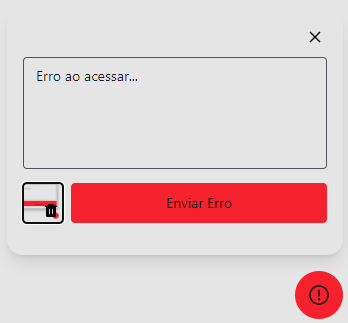
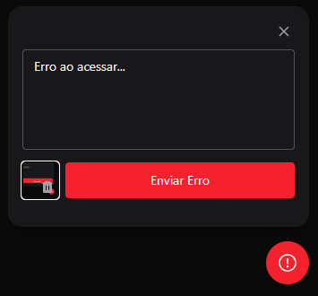
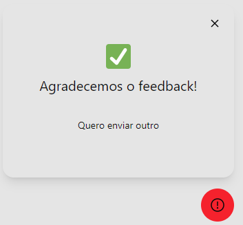
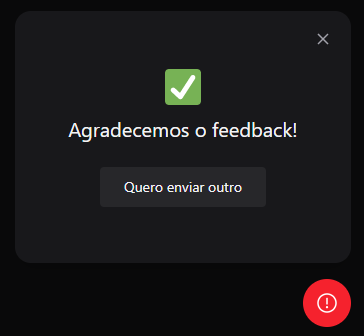

# Geterr

  Project developed to get messages error with most accurately 🚀

## 👀 Images

  
  

 

  
  

## 🚀 Technologies

- [ReactJS](https://reactjs.org/)
- [Tailwind CSS](https://tailwindcss.com/)
- [Vitejs](https://vitejs.dev/)
- [Express](https://expressjs.com/)

## 💻 Getting started

First, clone de project:

    git clone git@github.com:K4ME/geterr.git

Install the dependencies

    npm install

Run the code

    npm run dev

  Made with 💜 by <a href="https://www.linkedin.com/in/guilhermemacrini/">Guilherme Macrini</a>

